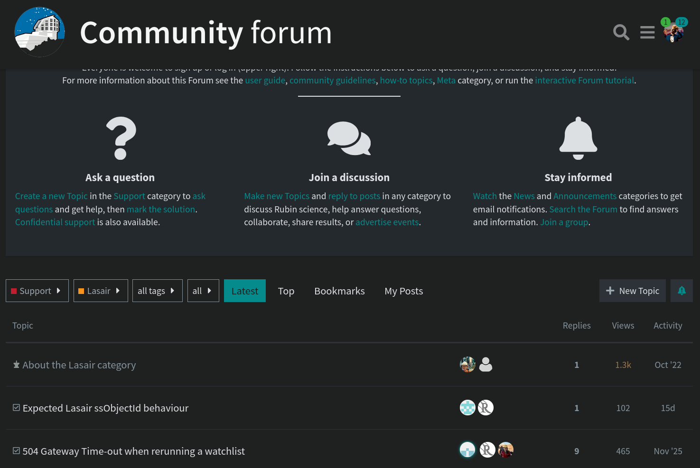

<p align="center">

</p>

<h1 align="center">  Lasair LSST Tutorials </h1>


This repository is dedicated to a suite of tutorials to help you get started with using Lasair to accept the LSST Alert data. 
For Further information we have [ReadTheDocs](https://lasair-lsst.readthedocs.io/en/main/) pages, and their relevant subsections will be sign posted where relevant in these tutorials 


## How to use these examples?

There are two kinds of resources:
* **Notebooks**: detailed step-by-step jupyter notebooks explaining how the code and data work. 
* **Scripts**: self-contained and well commented code templates that can be copy-pasted directly.  

Generally speaking the notebooks will have more explanations because they allow for more verbose descriptions. 

### Note: Work in Progress
These docs will be completed over the next few weeks to include more details and port some of the code from the [old notebooks](https://github.com/lsst-uk/lasair-examples/tree/main). Eventually the old repo will only contain the Lasair ZTF examples and this repo will focus on LSST.

## Pre-requisites

1. Install `lasair` python client

```
pip3 install lasair
```

2. A Valid Token (only for API / Kafka does not require a token)

You'll need to [register](https://lasair-lsst.lsst.ac.uk/register) to the Lasair platform so you can find your personal token on your [Profile](https://lasair-lsst.lsst.ac.uk/profile) page. 

**DO NOT SHARE THIS TOKEN WITH ANYOME**

## Have Any Suggestions? 

Feel free to fork this repository to propose changes, or open an issue to make a request. 

## How to get help?

If you have a question or need any help, you can find past questions or as a new one on the **[Community Forum](https://community.lsst.org/c/support/support-lasair/55)**.





